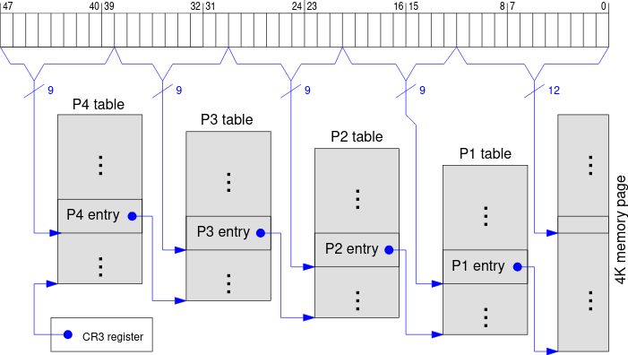

# Paging - Part 3

## Zmiany w projekcie

Tą część zaczniemy inaczej bo od zmian które następują w projecie. 

Nowa struktura projektu:
```
|---Makefile
|---build
|   | ...
|---src
    |---boot
    |   |---checks
    |   |   |---cpuid.asm
    |   |   |---longmode.asm
    |   |   |---multiboot.asm
    |   |---paging.asm
    |---boot.asm
    |---multiboot_header.asm
    |---linker.ld
    |---grub.cfg
```

Jak widzimy pojawiło nam sie łacznie 4 nowe pliki:
- cpuid.asm
- longmode.asm
- multiboot.asm
- paging.asm

Plik `paging.asm` zostanie wyjaśniony później a na ten moment zajmijmy się pierwszymi trzema plikami. Do tych plików zostały przeniesione testy które wcześniej znajdowały się w pliku boot.asm w celu lekkiego uprzątnięcia kodu. Teraz trzeba te pliki importować w następujący sposób:

> plik: boot.asm
```x86asm
%include "src/boot/checks/multiboot.asm"
%include "src/boot/checks/cpuid.asm"
%include "src/boot/checks/longmode.asm"
```

Ważne jest również aby wszystkie te pliki zaczynały się od `bits 32` jako że jestesmy nadal w trybie 32 bitowym.

## Wprowadzenie

Paging, jest to metoda zarządzania pamięcią która oddziela pamięć wirtualną od pamięci fizycznej. Przestrzeń adresowa jest podzielona na równego rozmiaru "strony" i `page table` definiuje który adres wirtualny którego któremu  adresowi fizycznemu.

W `x86_64` rozmair strony to 4096 bajtów i 4 poziomiwe "strony", każda ze "stron" posiada 512, 8 bajtowych sektorów. 



## Struktura sektoru strony

| Bity  | Nazwa                 | Opis                                                              |
| ----- | --------------------- | ----------------------------------------------------------------- |
| 0     | present               | strona znajduje się w pamięci                                     |
| 1     | writable              | można zapisać do strony                                           |
| 2     | user accesible        | dostępna na poziomie urzytkownika                                 |
| 3     | write through caching | bezpośredni zapis                                                 |
| 4     | no cache              | nie urzywaj pamięci cache                                         |
| 5     | accesed               | CPU ustawia ten bit kiedy strona jest w użyciu                    |
| 6     | dirty                 | CPU ustawia ten bit kiedy strona jest w trakcie zapisu            |
| 7     | huge page/null        | strona rozszerzona do 2MB w Page Level 2 i do 1 GB w Page Level 3 |
| 8     | global                | strona nie jest zapisywana jeśli znajduje się w pamięci cache     |
| 9-11  | available             | dostępne dla systemu                                              |
| 12-52 | -                     | pominięte, ze względu na unikalnośc adresów                       |
| 52-62 | available             | dostępne dla systemu                                              |
| 63    | no execute            | zakaz wykonywania kodu z tej strony (bit NXE)                     |

## Ograniczenia

Używając bitu `huge page` na stronach poziomu trzeciego moglibyśmy mapować pierwszy 1GB naszego kernela do pojedyńczej strony co bo znacznie poprawiło jego responsywność i pozwoliło procesorowi na ustalenie lepszych zasad cache-owania. Niestety nie możemy tego zrobić ponieważ `huge page` na L3 został wprowadzony dopiero w generacji `Westmere` (seria Xeon), `Haswell` (seria Core I 4 gen), a więc aby zagwarantować kompatybilnośc z starszymi procesorami i maszynami wirtualnymi będziemy stosować bit `huge page` na stronach L2

Strony są przeszukiwane idąc od L4 do L1, przez co najpierw jest przeszukiwana najdawniej alokowana pamięć.

Paging nie oznacza możliwości alokacji na heap. Do tego trzeba dalej napisać alokator (nie będziemy tego robić).

Paging nie jest zawsze taki sam, w przypadku bardzo dużej ilości pamięci inaczej się rozkłada strony. Są również bardziej zaawansowane metody translacji adresów.

Paging jest ściśle wymagany przez tryb 64 bitowy, bez niego procesor nie wejdzie w ten tryb i wykona przerwanie które kończy się instrukcją `halt`.

## Ktoś może zapytać, po co nam paging, co umożliwia?
Paging jest konieczny do wejścia do trybu 64 bitowego który jest... tak naprawdę 48 bitowy jeśli patrzymy na adresowanie. Maksymalna ilość adresów bezpośrednio w TLB to 2^48 czyli *teoretycznie* możliwe jest adresowanie 32 TB pamięci RAM. 

Ale czemu *teoretycznie*? -> Musimy jeszcze wziąć pod uwagę pamięć cache oraz pamięć `SWAP` lub architekturę NUMA (jej nie będziemy implementować aby wszystko uprościć). 

Te typy pamięci są bardzo ważne z różnych powodów w które nie chcę się zagłębiać ale żeby poprawnie działały musi istnieć paging który będzie nam tłumaczył adresy fizyczne tych obszarów na adresy wirtualne które będą możliwe do użycia przez procesor i programy które wykonuje. 

## Inplementacja

W pierwszym kroku musimy na nasze page-e stworzyć obszar na stacku. Najłatwiej będzie to zrobić modyfikując obszar danych statycznych `.bss`

> plik: boot.asm
```x86asm
; sekcja danych statycznych
section .bss
align 4096
; zarezerwowanie miejsca na kolejne PAGE-e do adresowania pamięci
p4_table:
    resb 4096
p3_table:
    resb 4096
p2_table:
    resb 4096

stack_bottom:
    resb 64
stack_top:
``` 

Pojawiły nam tu się 3 strony pamięci p2, p3 oraz p4. Słowo `align` jest tutaj dosyć ważne jako że chcemy aby te tabele były równej wielkości i zajmowały takie same obszary pamięci (gdyby nie obecność stack-u nie było by to konieczne). Teraz wystarczy je odpowiednio mapować, adresy tabeli p4 są już gotowe jako że GRUB initializuje sekcje `.bss` do zer, zostaje więc mapowanie p4->p3 i p3->p2.

> plik: src/boot/paging.asm
```x86asm
bits    32

; metoda odpowiedzialna za zapełnienie tablic P2-P4 odpowiednimi adresami
set_up_pageing:
    ; mapowanie P4 do P3
    mov eax, p3_table
    or eax, 0b11 
    mov [p4_table], eax

    ; analogiczny proces dla P3 do P2
    mov eax, p2_table
    or eax, 0b11
    mov [p3_table], eax

    ; mapowanie pól P2 do 2MiB stron pamięci 
    mov ecx, 0         ; counter, takie i w pętli

.map_p2:
    mov eax, 0x200000  
    mul ecx                
    or eax, 0b10000011 
    
    mov [p2_table + ecx * 8], eax

    inc ecx
    cmp ecx, 512       
    jne .map_p2

    ret

; włączenie pagingu
enable_paging:
    mov eax, p4_table
    mov cr3, eax

    mov eax, cr4
    or eax, 1 << 5
    mov cr4, eax

    mov ecx, 0xC0000080
    rdmsr
    or eax, 1 << 8
    wrmsr

    mov eax, cr0
    or eax, 1 << 31
    mov cr0, eax

ret
```